<div align="center">

# PROJECT STRUCTURE GENERATOR

### One command. One approved structure. Every project starts consistently.

A deterministic, framework-aware CLI for generating reusable project structures across backend services, frontend applications, CLIs, workers, and shared libraries.

Define architectural conventions once, save them in a filesystem vault, and reuse them across teams, microservices, repositories, and AI-assisted development workflows.

<br />

[](https://www.npmjs.com/package/@naresh007/project-structure-generator)
[](https://www.npmjs.com/package/@naresh007/project-structure-generator)
[](https://github.com/Phoenixarjun/project-structure-generator/actions/workflows/ci.yml)
[](LICENSE)

[](https://nodejs.org/)
[](https://www.typescriptlang.org/)
[](#built-in-catalogue)
[](#capability-packs)
[](#design-principles)
[](#design-principles)

<br />

[Why It Exists](#why-this-project-exists) ·
[How It Works](#how-it-works) ·
[Quick Start](#quick-start) ·
[Catalogue](#built-in-catalogue) ·
[Vaults](#vaults-profiles-and-organizational-reuse) ·
[Security](#security-model) ·
[Documentation](#documentation)

</div>

---

## 🎯 Why This Project Exists

Starting a new project is easy.

Starting the **twelfth service with the same conventions as the first eleven** is where the real problem begins.

Without an explicit structural standard, repositories slowly diverge:

```text
service-a/                    service-b/                    service-c/
├── api/                     ├── controllers/             ├── routes/
├── application/             ├── services/                ├── usecases/
├── domain/                  ├── models/                  ├── core/
└── infrastructure/          └── repositories/            └── adapters/
```

Each structure may be reasonable independently. Together, they create long-term friction:

* Engineers repeatedly decide where code should live.
* Similar services use different naming and package conventions.
* New contributors spend time rediscovering repository structure.
* Refactoring and code review become inconsistent.
* Documentation gradually diverges from implementation.
* Coding agents must relearn every repository before making safe changes.
* Organization-wide standards remain tribal knowledge instead of executable configuration.

**Project Structure Generator turns those conventions into deterministic, reusable assets.**

```text
Approved Blueprint
        +
Maturity Level
        +
Capability Packs
        +
Project Variables
        =
Consistent, Working Project Skeleton
```

This is not about saving a few `mkdir` commands.

It is about making architectural conventions **repeatable, inspectable, shareable, and reusable from day zero**.

---

## ✨ What Makes It Different

Most scaffolding tools solve only the first five minutes of a project.

Project Structure Generator is designed around a different problem:

> How can an individual, team, or organization start every project from an approved structure without answering the same questions or copying an increasingly stale repository?

The tool provides:

* **Architecture-specific blueprints** rather than generic empty folder trees.
* **Guided decisions** based on project type, framework, structure, and maturity.
* **Reusable profiles** that preserve approved selections.
* **Filesystem vaults** for organization-specific blueprints and packs.
* **Capability composition** for testing, databases, observability, CI, and infrastructure.
* **Deterministic output** suitable for local development and CI.
* **Safe capture** of an existing project into a reusable blueprint.
* **No arbitrary template hooks** and no AI dependency during generation.

---

## 🤖 Why Consistency Matters for Humans and Coding Agents

A predictable repository is easier to understand because responsibility has a stable location.

When every service follows an approved convention:

```text
src/
├── api/
├── application/
├── domain/
├── infrastructure/
├── shared/
└── workers/
```

developers and coding agents can make stronger assumptions:

* HTTP entry points live in a known location.
* Business workflows are separated from infrastructure.
* Database and broker integrations have predictable boundaries.
* Tests mirror the production structure.
* Logging, configuration, and health checks follow shared conventions.
* Generated services can reuse the same instructions, reviews, and automation.

The generator does not ask an AI model to invent an architecture.

It makes your chosen architecture **explicit and repeatable**, reducing the repository-specific context that humans and agents must rediscover.

---

## 🧭 How It Works

```mermaid
flowchart LR
    A[Choose Entry Mode] --> B[Select Blueprint]
    B --> C[Select Maturity]
    C --> D[Select Capability Packs]
    D --> E[Provide Project Variables]
    E --> F[Preview Generation Plan]
    F --> G[Safe Filesystem Writer]
    G --> H[Generated Project]
    H --> I[Save Profile or Capture Blueprint]
    I --> J[Reuse Across Future Projects]
```



The generation model is intentionally deterministic:

```text
Architecture-Specific Base Blueprint
        +
Accepted Maturity Recommendations
        +
Compatible Capability Packs
        +
Project and Feature Variables
        =
Generation Plan
```

Architecture is part of the blueprint. It is not applied later as a fragile overlay.

---

## 🧩 Core Capabilities

| Capability                | What it provides                                                              |
| ------------------------- | ----------------------------------------------------------------------------- |
| **Guided Creation**       | Build projects through a structured terminal workflow.                        |
| **Quick Templates**       | Start from a curated blueprint with sensible defaults.                        |
| **Direct Blueprint Mode** | Generate immediately when the exact blueprint is already known.               |
| **Profiles**              | Save framework, structure, maturity, packs, and defaults for reuse.           |
| **Vaults**                | Store workspace, user, and organization-specific resources on the filesystem. |
| **Capability Packs**      | Add Docker, CI, databases, observability, infrastructure, and tests.          |
| **Project Capture**       | Convert an existing approved repository into a reusable blueprint.            |
| **Dry Run and Preview**   | Inspect the complete generation plan before files are written.                |
| **JSON Output**           | Integrate catalogue and generation operations into automation.                |
| **Safe Writes**           | Prevent traversal, unsafe symlink writes, and accidental overwrites.          |
| **Provenance**            | Record how a project was generated in `.structgen.json`.                      |
| **Catalogue Validation**  | Validate manifests, template paths, variables, and compatibility rules.       |

---

## 🚀 Quick Start

### Run without installing

```bash
npx -y @naresh007/project-structure-generator@latest create
```

The guided CLI offers four entry modes:

```text
How would you like to start?

  1. Build as You Go
  2. Quick Template
  3. Reuse From Vault
  4. Direct Blueprint
```

### Install globally

```bash
npm install --global @naresh007/project-structure-generator
```

Then use:

```bash
structgen create
```

### Inspect the catalogue

```bash
structgen catalogue matrix
```

### Validate the catalogue and local vaults

```bash
structgen catalogue validate
```

### Inspect one blueprint

```bash
structgen show python-fastapi-feature-modular
```

### Preview without writing files

```bash
structgen create java-spring-modular-monolith ./orders-service \
  --set projectName=orders-service \
  --dry-run \
  --interactive=false
```

---

## 🛠️ Creation Modes

### 1. Build as You Go

Use the guided path when you know what you are building but have not selected the exact blueprint.

```bash
structgen create
```

The CLI guides you through:

```text
Project Type
→ Blueprint
→ Maturity
→ Capability Packs
→ Initial Features or Modules
→ Project Variables
→ Preview
→ Generate
```

### 2. Quick Template

Choose a curated blueprint and provide only the required project-specific values.

```bash
structgen create --quick
```

### 3. Reuse From Vault

Reuse an organization or workspace profile without answering the same architectural questions again.

```bash
structgen create --profile aivon-python-service
```

Only unresolved values, such as project name and initial modules, are requested.

### 4. Direct Blueprint

Use expert mode when the exact blueprint is known.

```bash
structgen create python-fastapi-feature-modular ./billing-service \
  --set projectName=billing-service \
  --feature billing \
  --interactive=false
```

---

## 🐍 Example: FastAPI Feature-Modular Service

```bash
structgen create python-fastapi-feature-modular ./identity-service \
  --set projectName=identity-service \
  --feature authentication \
  --feature users \
  --interactive=false
```

A feature-modular project can generate a structure similar to:

```text
identity-service/
├── src/
│   └── identity_service/
│       ├── main.py
│       ├── bootstrap/
│       │   ├── application.py
│       │   └── routes.py
│       ├── shared/
│       │   ├── config/
│       │   ├── errors/
│       │   ├── logging/
│       │   └── infrastructure/
│       └── features/
│           ├── authentication/
│           │   ├── router.py
│           │   ├── schemas.py
│           │   ├── service.py
│           │   ├── repository.py
│           │   └── models.py
│           └── users/
│               ├── router.py
│               ├── schemas.py
│               ├── service.py
│               ├── repository.py
│               └── models.py
├── tests/
│   ├── unit/
│   └── integration/
├── pyproject.toml
├── .env.example
└── README.md
```

---

## ▲ Example: Next.js Feature-Modular Application

```bash
structgen create nextjs-feature-modular ./operations-console \
  --set projectName=operations-console \
  --feature authentication \
  --feature dashboard \
  --interactive=false
```

A generated feature can own its local UI, hooks, schemas, API integration, and server logic:

```text
src/
├── app/
├── components/
│   ├── ui/
│   └── shared/
├── features/
│   ├── authentication/
│   │   ├── actions/
│   │   ├── api/
│   │   ├── components/
│   │   ├── hooks/
│   │   ├── schemas/
│   │   ├── server/
│   │   ├── tests/
│   │   ├── types/
│   │   └── index.ts
│   └── dashboard/
├── lib/
│   ├── dal/
│   └── server/
├── config/
└── types/
```

Shared components stay under `src/components`.

Feature-specific code stays inside its feature boundary.

---

## 📈 Maturity Levels

Maturity controls the amount of supporting rigor generated around the selected architecture.

| Level           | Intended Use                                      | Typical Additions                                                               |
| --------------- | ------------------------------------------------- | ------------------------------------------------------------------------------- |
| **Prototype**   | Experiments, MVPs, learning, hackathons           | Minimal configuration, linting, basic tests                                     |
| **Standard**    | Capstones, maintained applications, small teams   | Stronger tests, Docker, CI recommendations, documentation                       |
| **Operational** | Long-lived, team-owned, integration-heavy systems | Health checks, structured logging, observability readiness, integration testing |

> **Operational does not mean automatically production-ready.** It adds operational scaffolding, but production readiness still depends on security, deployment, capacity planning, testing, and organizational requirements.

---

## 📚 Built-In Catalogue

The current catalogue includes 23 architecture-specific blueprints.

<details>
<summary><b>Python Backend</b></summary>

| Blueprint                        | Framework | Structure            |
| -------------------------------- | --------- | -------------------- |
| `python-fastapi-native`          | FastAPI   | Framework native     |
| `python-fastapi-layered`         | FastAPI   | Technical layered    |
| `python-fastapi-feature-modular` | FastAPI   | Feature modular      |
| `python-flask-blueprint-native`  | Flask     | Blueprint native     |
| `python-flask-layered`           | Flask     | Technical layered    |
| `python-flask-feature-modular`   | Flask     | Feature modular      |
| `python-django-apps`             | Django    | Framework apps       |
| `python-django-domain-apps`      | Django    | Domain-oriented apps |
| `python-django-modular-apps`     | Django    | Modular apps         |

</details>

<details>
<summary><b>Java Backend</b></summary>

| Blueprint                        | Framework   | Structure          |
| -------------------------------- | ----------- | ------------------ |
| `java-spring-layered`            | Spring Boot | Technical layered  |
| `java-spring-package-by-feature` | Spring Boot | Package by feature |
| `java-spring-modular-monolith`   | Spring Boot | Modular monolith   |

</details>

<details>
<summary><b>Go</b></summary>

| Blueprint             | Framework        | Structure               |
| --------------------- | ---------------- | ----------------------- |
| `go-minimal`          | Standard library | Minimal                 |
| `go-command-internal` | Standard library | `cmd/` with `internal/` |
| `go-domain-modular`   | Standard library | Domain modular          |

</details>

<details>
<summary><b>React and Next.js</b></summary>

| Blueprint                  | Framework    | Structure         |
| -------------------------- | ------------ | ----------------- |
| `react-simple`             | React + Vite | Simple type-based |
| `react-feature-based`      | React + Vite | Feature-based     |
| `nextjs-app-router-native` | Next.js      | App Router native |
| `nextjs-route-colocated`   | Next.js      | Route-colocated   |
| `nextjs-feature-modular`   | Next.js      | Feature modular   |

</details>

<details>
<summary><b>TypeScript CLI</b></summary>

| Blueprint                         | Runtime | Structure        |
| --------------------------------- | ------- | ---------------- |
| `typescript-cli-minimal`          | Node.js | Minimal          |
| `typescript-cli-command-oriented` | Node.js | Command-oriented |
| `typescript-cli-modular`          | Node.js | Modular          |

</details>

View the live support matrix:

```bash
structgen catalogue matrix
```

Machine-readable output:

```bash
structgen catalogue matrix --json
```

---

## 🧱 Capability Packs

Capability packs extend a compatible blueprint without redefining its source architecture.

| Pack                     | Contribution                                                 |
| ------------------------ | ------------------------------------------------------------ |
| `unit-tests`             | Framework-appropriate unit testing                           |
| `integration-tests`      | Integration test layout and configuration                    |
| `docker`                 | `Dockerfile` and `.dockerignore`                             |
| `docker-compose`         | Application and selected backing services                    |
| `github-actions`         | CI workflow                                                  |
| `postgres`               | PostgreSQL dependencies, configuration, and adapter skeleton |
| `redis`                  | Redis client and lifecycle configuration                     |
| `kafka`                  | Producer, consumer, and event configuration skeleton         |
| `structured-logging`     | Framework-appropriate structured logging                     |
| `opentelemetry`          | Tracing initialization and configuration                     |
| `terraform`              | Terraform infrastructure scaffold                            |
| `kubernetes`             | Kustomize-based Kubernetes deployment structure              |
| `helm`                   | Helm chart scaffold                                          |
| `documentation-showcase` | Architecture docs, ADRs, and contributor guidance            |

Only compatible packs are offered for the selected blueprint.

---

## 🗄️ Vaults, Profiles, and Organizational Reuse

A vault is a filesystem-backed catalogue containing reusable blueprints, packs, and profiles.

```text
.structgen/
└── vault/
    ├── blueprints/
    ├── packs/
    └── profiles/
```

### Resolution precedence

```text
Explicit --vault paths
        ↓
structgen.config.json vaults
        ↓
Workspace .structgen/vault
        ↓
User ~/.structgen/vault
        ↓
Built-in catalogue
```

Higher-precedence resources override lower-precedence resources with the same ID.

### Initialize a workspace vault

```bash
structgen vault init --scope workspace
```

Commit `.structgen/` and `structgen.config.json` to source control so every team member and automation agent receives the same defaults.

### Example organization profile

```json
{
  "schemaVersion": 1,
  "id": "company-python-service",
  "name": "Company Python Service",
  "selection": {
    "projectType": "backend-service",
    "language": "python",
    "framework": "fastapi",
    "blueprint": "python-fastapi-feature-modular",
    "maturity": "operational",
    "capabilities": [
      "unit-tests",
      "integration-tests",
      "docker",
      "postgres",
      "structured-logging",
      "opentelemetry",
      "github-actions"
    ]
  },
  "variables": {
    "sourceLayout": "src"
  },
  "output": "./services/{{projectName}}"
}
```

Reuse it:

```bash
structgen create --profile company-python-service
```

This is especially useful for microservice platforms where every service should follow the same source layout, testing strategy, logging conventions, health checks, and delivery setup.

---

## 📦 Capture an Existing Project

Turn a proven project into a reusable blueprint:

```bash
structgen vault capture ./services/billing-runtime \
  --id company-fastapi-service \
  --name "Company FastAPI Service" \
  --replace billing-runtime=projectName:kebab \
  --replace billing_runtime=packageName:snake \
  --scope workspace
```

Capture is useful when the best template already exists as a real repository.

The capture workflow excludes common dependency and build directories and checks for sensitive files before saving the blueprint.

---

## ⚙️ Non-Interactive and CI Usage

Provide every required value explicitly:

```bash
structgen create python-fastapi-layered ./billing \
  --set projectName=billing \
  --capability docker \
  --capability github-actions \
  --interactive=false \
  --json
```

Dry run:

```bash
structgen create python-fastapi-layered ./billing \
  --set projectName=billing \
  --capability docker \
  --interactive=false \
  --dry-run
```

JSON output is suitable for scripts and CI pipelines.

---

## 🔐 Security Model

The generator treats templates as declarative data, not executable programs.

* **Path containment** prevents files from escaping the destination.
* **Symlink protection** rejects unsafe filesystem traversal.
* **Overwrite protection** preserves existing files unless `--force` is explicit.
* **Secret detection** protects profile storage and blueprint capture.
* **No arbitrary hooks** means templates cannot execute shell commands.
* **Deterministic planning** detects conflicts before filesystem writes.
* **Sensitive provenance values** are redacted from `.structgen.json`.

Read the full policy in [docs/SECURITY.md](docs/SECURITY.md).

---

## 🧠 Design Principles

### Deterministic over intelligent

The same blueprint, profile, variables, maturity, and packs should generate the same result.

### Architecture before tooling

The source organization comes from an architecture-specific blueprint. Infrastructure packs extend it without redefining it.

### Convention without runtime lock-in

Generated applications do not require Project Structure Generator at runtime.

### Filesystem-first reuse

Vaults are ordinary files and directories that can be reviewed, versioned, and committed.

### Safe by default

Templates do not execute arbitrary code, and existing files are protected.

### Useful before universal

The project prioritizes curated, working structures over claiming support for every framework.

---

## ⌨️ CLI Reference

```text
structgen create
structgen plan
structgen list
structgen show
structgen doctor
structgen validate

structgen profile list
structgen profile show
structgen profile create
structgen profile remove
structgen profile validate

structgen vault list
structgen vault inspect
structgen vault init
structgen vault capture
structgen vault import
structgen vault remove
structgen vault validate

structgen catalogue validate
structgen catalogue matrix
```

Run:

```bash
structgen --help
```

for the current command reference.

---

## 📖 Documentation

| Document                                                   | Purpose                                      |
| ---------------------------------------------------------- | -------------------------------------------- |
| [Getting Started](docs/GETTING_STARTED.md)                 | Installation and first project               |
| [CLI Reference](docs/CLI.md)                               | Commands, options, and exit behavior         |
| [Product Model](docs/PRODUCT_MODEL.md)                     | Blueprint, pack, profile, and vault concepts |
| [Catalogue](docs/CATALOGUE.md)                             | Supported frameworks and structures          |
| [Blueprint Specification](docs/BLUEPRINT_SPEC.md)          | Blueprint manifest format                    |
| [Pack Specification](docs/PACK_SPEC.md)                    | Capability pack format                       |
| [Profile Specification](docs/PROFILE_SPEC.md)              | Reusable profile format                      |
| [Vaults](docs/VAULTS.md)                                   | Resolution and organizational reuse          |
| [Security](docs/SECURITY.md)                               | Filesystem and template security model       |
| [Extending the Catalogue](docs/EXTENDING_THE_CATALOGUE.md) | Adding custom blueprints and packs           |
| [Troubleshooting](docs/TROUBLESHOOTING.md)                 | Common errors and fixes                      |

---

## 🧪 Development

```bash
git clone https://github.com/Phoenixarjun/project-structure-generator.git
cd project-structure-generator

npm ci
npm run typecheck
npm test
npm run test:coverage
npm run build
```

Validate the catalogue:

```bash
npm run catalogue:validate
```

Inspect the npm package:

```bash
npm pack --dry-run
```

---

## 🤝 Contributing

Contributions are welcome for:

* blueprint corrections
* generated-project build fixes
* compatibility rules
* security hardening
* documentation
* new capability packs
* carefully justified framework support

Before proposing a new blueprint, ensure that it:

1. represents a meaningful and documented structure,
2. generates working code rather than empty folders,
3. has an explicit compatibility contract,
4. includes generated-project validation,
5. does not duplicate an existing blueprint with different naming.

Read [CONTRIBUTING.md](CONTRIBUTING.md) before opening a pull request.

---

## 👨‍💻 Author

**Naresh B A**

[](https://github.com/Phoenixarjun)
[](https://www.linkedin.com/in/naresh-b-a-1b5331243)
[](https://www.npmjs.com/~naresh007)

---

## 📄 License

Released under the [MIT License](LICENSE).

---

<div align="center">

### Stop rebuilding repository conventions. Start reusing them.

<sub>Project Structure Generator — consistent foundations for humans, teams, microservices, and coding agents.</sub>

</div>
